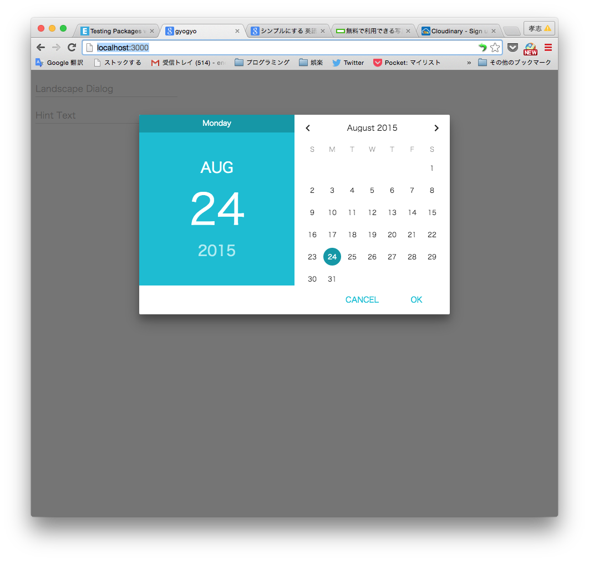

## Introduction

This package is base on [izzilab:material-ui](https://atmospherejs.com/izzilab/material-ui)
It made to simple your material-life.

## Install

`meteor add endotakashi:material-ui-mixin`

## Using
You can use `Material-UI`,just add one line.
```
var App = React.createClass({
    mixin:[MaterialUIMixin],
    render: function() {
        return (
            <div>
                <DatePicker hintText="Landscape Dialog" mode="landscape"/>
                <TextField hintText="Hint Text" />
            </div>
        );
    }
});
```

## Demo
<a target='_brank' href='http://material-ui-mixin.meteor.com'>デモページ</a>

